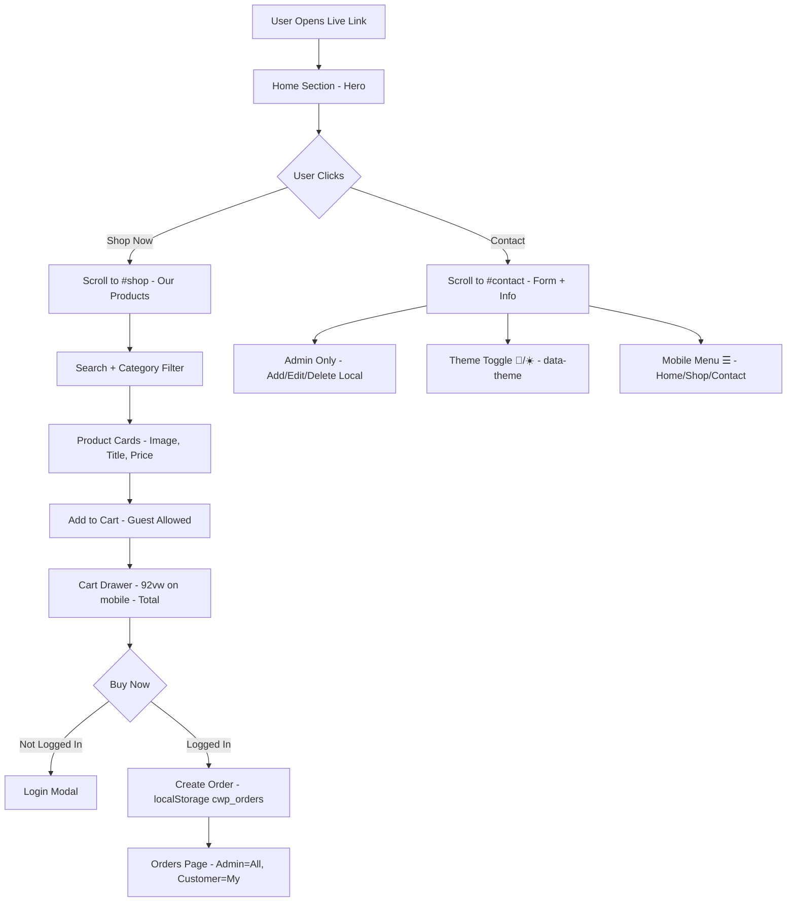

# ComWebP.SHOP - Modern E-Commerce Platform

[Vite](https://img.shields.io/badge/Vite-v8.2.2-646CFF?logo=vite)
[React](https://img.shields.io/badge/React-18-61DAFB?logo=react)
[Tailwind](https://img.shields.io/badge/Tailwind-3.4.10-38BDF8?logo=tailwindcss)
[Live](https://img.shields.io/badge/Live-Production-success)

A fully responsive, bug-free e-commerce shop with **Home Hero**, **Shop**, **Cart**, **Contact Us**, dark/light theme, role-based auth and admin dashboard. Add to Cart is fully activated for guests.

### 🚀 Live Links

| Environment | URL |
|---|---|
| **Production (Main)** | **[https://comwebp-shop-new.vercel.app](https://comwebp-shop-new.vercel.app)** |
| **Latest Build - Home+Contact Update** | **[https://comwebp-shop-5b5mffts7-sayakameems-projects.vercel.app](https://comwebp-shop-5b5mffts7-sayakameems-projects.vercel.app)** |
| Local Dev | http://localhost:5175 |

### 📖 Project Description

**ComWebP.SHOP** is a modern single-page e-commerce platform built for small businesses in Bangladesh. It focuses on speed, mobile-first UX, and zero backend cost for demo.

**Home Section** explains the brand with a hero banner, New Collection badge, 10k+ customers trust stats, Free Delivery / COD / 7 Days Return chips, and two CTA buttons - Shop Now (scrolls to shop) and Contact Us (scrolls to contact). Right side has a hero shopping image.

**Shop Section** loads products from FakeStoreAPI + local API, with Search, Category filter (all, local, men's clothing, jewelery, electronics, women's clothing), Product cards with image fallback, Price, Add to Cart (works for guests), and Admin Edit/Delete for local products.

**Contact Us Section** is smartly divided into 2 columns - Left side shows Contact Info Cards (Email: support@comwebp.shop, Phone: +91 98765 43210, Address: Chittagong BD, Hours: 9AM-10PM) and Right side has a functional Contact Form (Name, Email, Message) with alert on submit.

**Cart & Orders** - Add to Cart works without login, cart count updates on header 🛒, drawer slides from right (92vw on mobile), Total calculation, Buy Now asks for login only at checkout. Orders are saved in localStorage. Admin sees All Orders, Customer sees My Orders only.

### ✨ Features Table

| Feature | Status | Description |
|---|---|---|
| Home Hero Section | ✅ Done | Title, description, stats, CTA, hero image, trust badges |
| Shop Section | ✅ Done | 240px grid, 2 col on mobile, search + category filter |
| Add to Cart | ✅ Activated | Guest allowed, qty increment, drawer opens, total |
| Contact Us Section | ✅ Done | Info cards + form with validation + thank you alert |
| Theme Toggle | ✅ Done | Light/Dark via data-theme, saved in localStorage |
| Mobile Menu ☰ | ✅ Done | Home, Shop, Contact + categories in hamburger overlay |
| Admin Role | ✅ Secure | Only admin@comwebp.shop can be admin, others forced to customer |
| Admin Dashboard | ✅ Done | Add/Edit/Delete local products, stock, imageUrl |
| Responsive | ✅ Done | 1 col <400px, 2 col tablet, 4 col desktop, 92vw cart |
| Deployment | ✅ Live | Vercel root directory `client`, vercel.json added |

### 🛠 Tech Stack Table

| Layer | Technology | Version | Use |
|---|---|---|---|
| Frontend | React + Vite | 18 / 8.2.2 | UI + Fast build |
| Styling | Tailwind CSS + Custom CSS Tokens | 3.4.10 | Responsive + theme vars |
| State | useState + localStorage | - | cart, users, orders, theme |
| API | FakeStoreAPI + Custom API | - | External + Local products |
| Deployment | Vercel | Latest | Production hosting |
| Icons | Emoji + Chip UI | - | No extra icon library |

### 🔐 User Roles Table

| Role | Email | Password | Access |
|---|---|---|---|
| **Admin** | `admin@comwebp.shop` | `admin123` | Sees Admin box, Add/Edit/Delete local products, Views All Orders |
| Customer | Any email you register | Your password | Add to Cart, Buy Now, Views My Orders only |

### 🏗 Architecture Flow Chart



### 📂 Folder Structure

```
ComWebP/
├── client/
│   ├── src/
│   │   ├── App.jsx      # Full App - Home + Shop + Contact + Cart + Auth + Admin
│   │   ├── main.jsx     # Root
│   │   └── index.css    # Tokens + hero + contact + grid + card + drawer styles
│   ├── index.html
│   ├── vercel.json      # Build config for root
│   └── package.json
├── vercel.json          # Root build: cd client && npm run build
├── .gitignore
└── README.md            # This file
```

### 💻 Installation Commands

```bash
git clone https://github.com/your-username/ComWebP.git
cd ComWebP/client
npm install
npm run dev -- --host
# http://localhost:5175
npm run build
vercel --prod --yes
```

### 🔧 Vercel Settings

| Setting | Value |
|---|---|
| Framework | Vite |
| Root Directory | client |
| Build Command | npm run build |
| Output Directory | dist |
| vercel.json | {"buildCommand":"cd client && npm run build","outputDirectory":"client/dist","framework":"vite"} |

### 📦 API Routes Table

| Method | Endpoint | Description |
|---|---|---|
| GET | /api/products | Get all local products |
| POST | /api/products | Add product (Admin) |
| PUT | /api/products/:id | Update product |
| DELETE | /api/products/:id | Delete product |
| GET | https://fakestoreapi.com/products | External products |

### 📬 Contact Section Details

| Field | Value |
|---|---|
| Email | support@comwebp.shop |
| Phone | +91 98765 43210 |
| Address | Chittagong, BD - 4000 |
| Hours | 9AM - 10PM, 7 Days |
| Form Fields | Name, Email, Message, Send Message button |

### © Footer

© 2026 ComWebP.SHOP - Free Delivery | COD | Made with ❤️ in Chittagong
```

**Now push:**

```cmd
cd /d D:\GitProjects\ComWebP
notepad README.md
```
Paste → Save →

```cmd
git add README.md
git commit -m "final readme with live link home shop contact description"
git push origin main
```